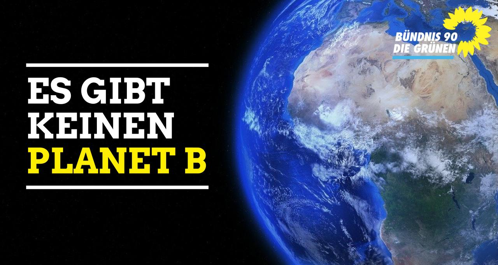

# Einleitung

## Zweck
Mit dem Sharepicgenerator kann man Bilder im Corporate Design von BÜNDNIS 90/ DIE GRÜNEN erstellen und herunterladen.

## Features
- Anpassbare Ausgabegröße
- Bildausschnitt frei wählbar
- für Bilder und Videos
- Templates für alle gängigen Social-Media-Plattformen
- eigenes Bild hochladbar
- mobil voll nutzbar
- voll mandantenfähig
- Bilder von Pixabay
- eigenes Logo wird dauerhaft gespeichert
- Schwarz-weiß-Filter für Hintergrundbild
- Open Source
- und vieles mehr
