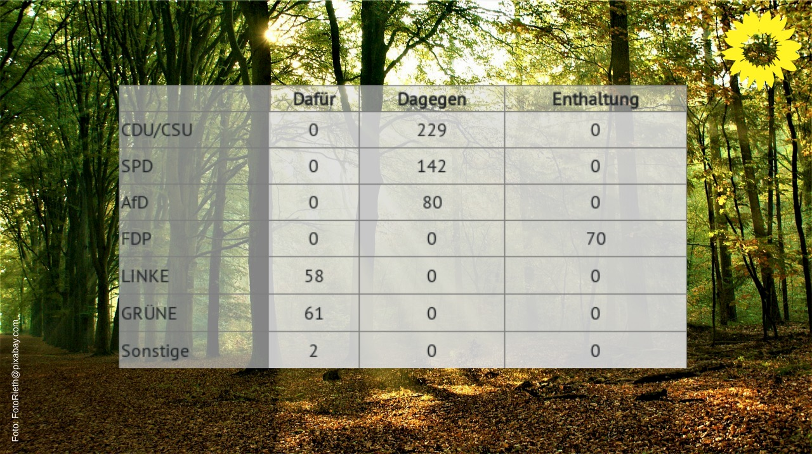

# Wie kann ich Tabellen erstellen?

1. Nutze zunächst den [Markdown-Editor](/markdown), um eine Tabelle zu erstellen
2. Lade die Tabelle als Bild herunter
3. Lade dieses Bild als *zusätzliches Bild* im Sharepicgenerator hoch.

Hier findest Du [mehr Infos zu Markdown](https://github.com/adam-p/markdown-here/wiki/Markdown-Cheatsheet).

Der [Markdown-Editor](/markdown) konvertiert Markdown zu HTML und erzeugt daraus ein Bild, das Du herunterladen kannst. 
Mit ein wenig CSS-Kenntnissen kannst Du das HTML vor dem Download in den Developertools manipulieren, z.B. die Farben ändern, etc. 