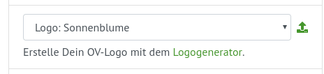
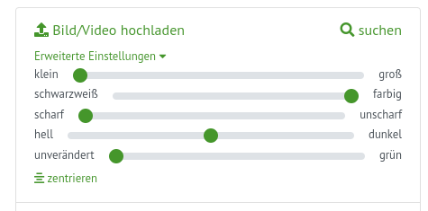

# Profieinstellungen

## Wie kann ich das Logo verändern?

- Rechts unten kannst Du aus verschiedenen Logos wählen. 
- Du kannst auch ein eigenes Logo hochladen. Klicke dazu auf das *Hochlade-Icon*
- Mit dem [Logogenerator](../logo) kannst Du auch ein eigenes Logo erstellen

## Kann ich das Hintergrundbild bearbeiten?

- Klicke auf *Bildeinstellungen* und verwende die Schieberegler
- Wähle den Bildausschnitt, indem Du das Bild mit gedrückt gehaltener Maustaste verschiebst. Das geht allerdings nur, wenn das Bild größer als der gewählte Bildausschnitt ist.

## Wie kann ich ein Icon nutzen?

- Klicke auf *Texteinstellungen* und dann auf *Icon hochladen* bzw. *Icon suchen*.
- Anschließend kannst Du die Größe des Icons wählen
- Ein Icon ist nur im Standard-Layout verfügbar.