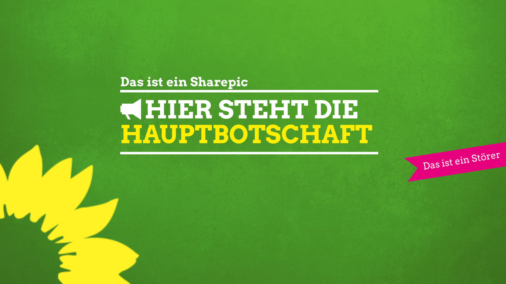

# Was ist ein Sharepic?

Ein Sharepic besteht aus 

- einem Hintergrundbild, das man frei wählen kann
- einer Hauptbotschaft (Slogan) zwischen den Linien
- einem Logo, das man auswählen kann
- ggf. einem Störelement (die pinke Fahne rechts am Rand)
- ggf. einem Icon innerhalb der beiden Linien

Alle diese Elemente kannst Du verändern.