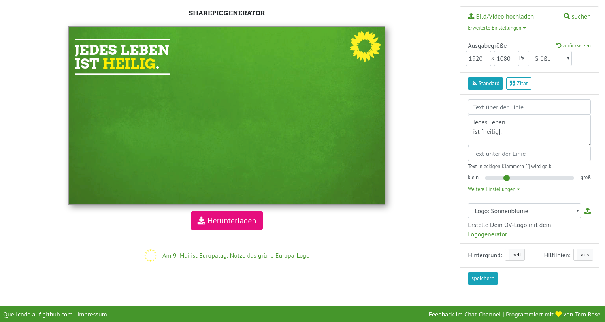

# Wie kann ich ein Sharepic erstellen?

1. Lade zunächst ein eigenes Bild hoch oder suche eines über die Online-Suche. **Ganz rechts oben**
1. Tippe dann Deine Hauptbotschaft in das Textfeld. **Am rechten Rand, in der Mitte**
1. Jetzt kannst Du mit der Maus den Text richtig platzieren. **Direkt auf dem Sharepic**
1. Passe bei Bedarf die Größe des Textes an. **Unterhalb des Textfeldes am rechten Rand**
1. Lade Dein Sharepic herunter mit dem Button *Herunterladen*. **Direkt unter dem Sharepic**
